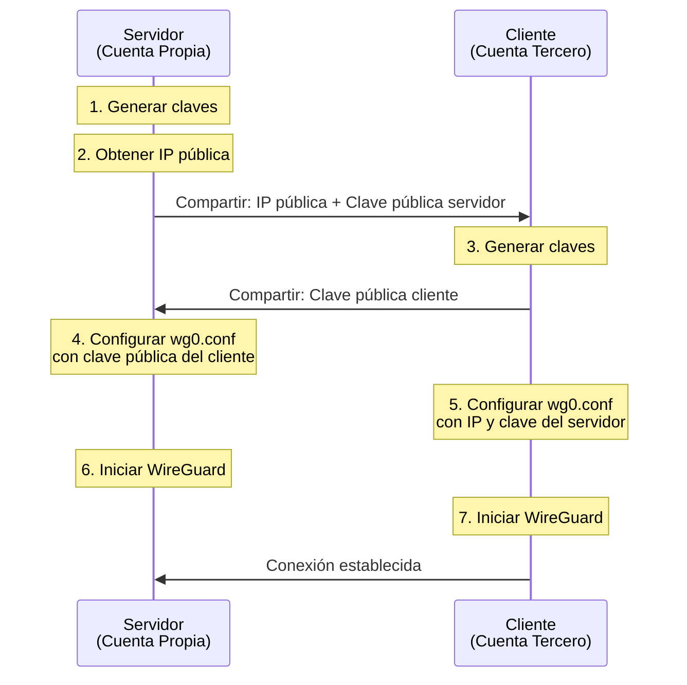

```mermaid
sequenceDiagram
    participant SP as Servidor<br/>(Cuenta Propia)
    participant CT as Cliente<br/>(Cuenta Tercero)
    
    Note over SP: 1. Generar claves
    Note over SP: 2. Obtener IP pública
    SP->>CT: Compartir: IP pública + Clave pública servidor
    
    Note over CT: 3. Generar claves
    CT->>SP: Compartir: Clave pública cliente
    
    Note over SP: 4. Configurar wg0.conf<br/>con clave pública del cliente
    Note over CT: 5. Configurar wg0.conf<br/>con IP y clave del servidor
    
    Note over SP: 6. Iniciar WireGuard
    Note over CT: 7. Iniciar WireGuard
    CT->>SP: Conexión establecida
```