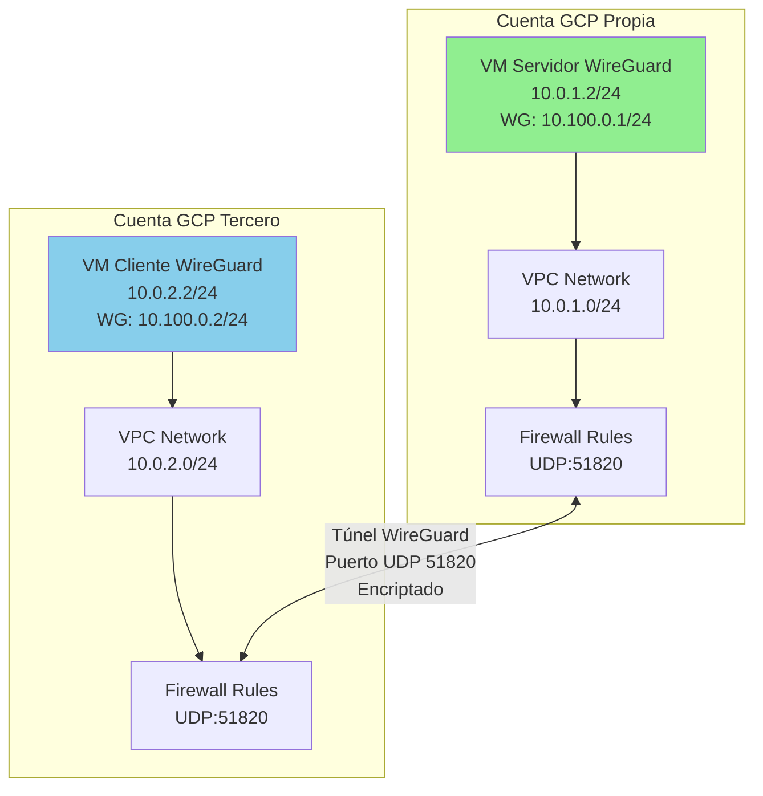

```mermaid
graph TB
    subgraph "Cuenta GCP Propia"
        A[VM Servidor WireGuard<br/>10.0.1.2/24<br/>WG: 10.100.0.1/24]
        B[VPC Network<br/>10.0.1.0/24]
        C[Firewall Rules<br/>UDP:51820]
        A --> B
        B --> C
    end
    
    subgraph "Cuenta GCP Tercero"
        D[VM Cliente WireGuard<br/>10.0.2.2/24<br/>WG: 10.100.0.2/24]
        E[VPC Network<br/>10.0.2.0/24]
        F[Firewall Rules<br/>UDP:51820]
        D --> E
        E --> F
    end
    
    C <--> |"Túnel WireGuard<br/>Puerto UDP 51820<br/>Encriptado"| F
    
    style A fill:#90EE90
    style D fill:#87CEEB
```