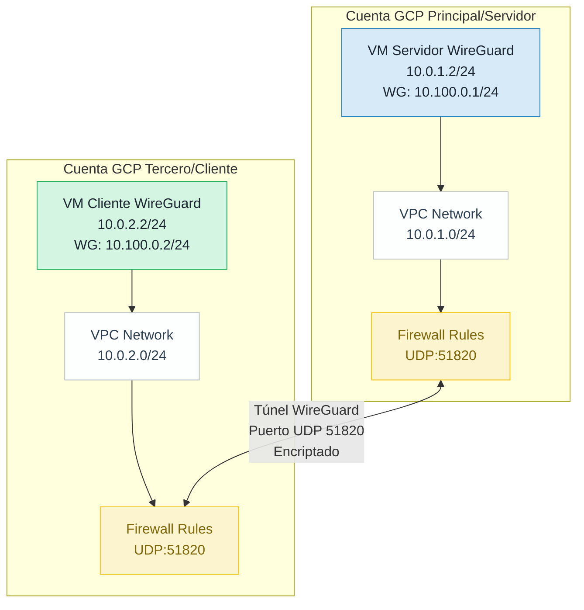
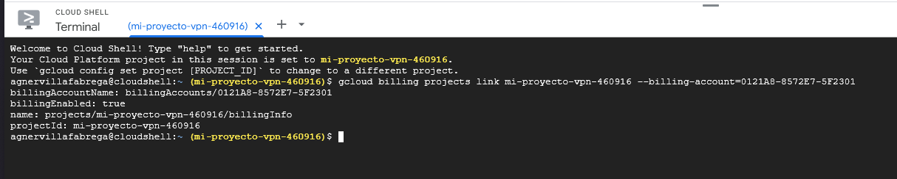

# Implementación de VPN WireGuard entre Servidores en Google Cloud Platform

## Índice

1. Descripción General
2. Arquitectura de la Solución
3. Prerrequisitos
4. Paso 1: Configuración del Entorno
5. Paso 2: Generación de Certificados y Claves
6. Paso 3: Configuración del Servidor VPN
7. Paso 4: Configuración del Cliente VPN
8. Paso 5: Establecimiento del Túnel
9. Paso 6: Pruebas y Verificación
10. Anexos
11. Conclusiones

## Descripción General

Esta guía detalla la implementación de una conexión VPN segura usando WireGuard entre dos servidores ubicados en diferentes cuentas de Google Cloud Platform. WireGuard es una VPN moderna, rápida y segura que utiliza criptografía de última generación.

### Objetivos

- Configurar dos instancias de VM en cuentas GCP separadas
- Implementar WireGuard como solución VPN
- Establecer un túnel seguro de comunicación entre los servidores
- Verificar la conectividad y transferencia segura de datos

## Arquitectura de la Solución



### Componentes Principales

1. **Servidor WireGuard (Cuenta Principal)**
    - IP Pública: Asignada por GCP
    - IP Privada VPC: 10.0.1.2/24
    - IP WireGuard: 10.100.0.1/24
    - Puerto: UDP 51820
2. **Cliente WireGuard (Cuenta Tercero)**
    - IP Pública: Asignada por GCP
    - IP Privada VPC: 10.0.2.2/24
    - IP WireGuard: 10.100.0.2/24

## Prerrequisitos

- Dos cuentas de Google Cloud Platform (Free Tier)
- Conocimientos básicos de Linux y redes
- Acceso a Google Cloud Console o gcloud CLI

## Paso 1: Configuración del Entorno

### 1.1 Configuración de la Cuenta Principal

```bash
# Crear el proyecto
gcloud projects create mi-proyecto-vpn-460916 --name="Mi Proyecto VPN"
gcloud config set project mi-proyecto-vpn-460916

# Habilitar servicios de computo
gcloud services enable compute.googleapis.com

# Crear VPC
gcloud compute networks create vpc-propia \\
    --subnet-mode=custom \\
    --bgp-routing-mode=regional

# Crear subnet
gcloud compute networks subnets create subnet-propia \\
    --network=vpc-propia \\
    --region=us-central1 \\
    --range=10.0.1.0/24

# Crear regla firewall para WireGuard - ssh
gcloud compute firewall-rules create allow-wireguard \\
    --network=vpc-propia \\
    --allow=udp:51820 \\
    --source-ranges=0.0.0.0/0

gcloud compute firewall-rules create allow-ssh \\
    --network=vpc-propia \\
    --allow=tcp:22 \\
    --source-ranges=0.0.0.0/0

# Crear instancia principal
gcloud compute instances create wg-server \\
    --zone=us-central1-a \\
    --machine-type=e2-micro \\
    --network-interface=network=vpc-propia,subnet=subnet-propia \\
    --image-family=ubuntu-2004-lts \\
    --image-project=ubuntu-os-cloud \\
    --boot-disk-size=10GB \\
    --tags=wireguard-server

```

### 1.2 Configuración de la Cuenta Tercero

Repetimos los mismos pasos pero con diferentes nombres y rangos de IP (para difenciarlos a simple vista):

```bash
# Crear el proyecto
gcloud projects create tercero-proyecto-vpn --name="Tercero Proyecto VPN"
gcloud config set project tercero-proyecto-vpn

# Habilitar servicios de computo
gcloud services enable compute.googleapis.com

# Crear VPC
gcloud compute networks create vpc-tercero \\
    --subnet-mode=custom \\
    --bgp-routing-mode=regional

# Crear subnet
gcloud compute networks subnets create subnet-tercero \\
    --network=vpc-tercero \\
    --region=us-central1 \\
    --range=10.0.2.0/24

# Crear reglas de firewall
gcloud compute firewall-rules create allow-wireguard-tercero \\
    --network=vpc-tercero \\
    --allow=udp:51820 \\
    --source-ranges=0.0.0.0/0

gcloud compute firewall-rules create allow-ssh-tercero \\
    --network=vpc-tercero \\
    --allow=tcp:22 \\
    --source-ranges=0.0.0.0/0

# Crear instancia del Cliente
gcloud compute instances create wg-client \\
    --zone=us-central1-a \\
    --machine-type=e2-micro \\
    --network-interface=network=vpc-tercero,subnet=subnet-tercero \\
    --image-family=ubuntu-2004-lts \\
    --image-project=ubuntu-os-cloud \\
    --boot-disk-size=10GB \\
    --tags=wireguard-client

```

## Paso 2: Generación de Certificados y Claves

### 2.1 En el Servidor (Cuenta Propia)

```bash
# Conectarse al servidor
gcloud compute ssh wg-server --zone=us-central1-a

# Instalar WireGuard
sudo apt update
sudo apt install -y wireguard

# Generar claves del servidor
cd /etc/wireguard
umask 077
wg genkey | sudo tee server_private.key
sudo cat server_private.key | wg pubkey | sudo tee server_public.key

# Guardar las claves
SERVER_PRIVATE_KEY=$(sudo cat server_private.key)
SERVER_PUBLIC_KEY=$(sudo cat server_public.key)

echo "Clave privada del servidor: $SERVER_PRIVATE_KEY"
echo "Clave pública del servidor: $SERVER_PUBLIC_KEY"

```

### 2.2 En el Cliente (Cuenta Tercero)

```bash
# Conectarse al cliente
gcloud compute ssh wg-client --zone=us-central1-a

# Instalar WireGuard
sudo apt update
sudo apt install -y wireguard

# Generar claves del cliente
cd /etc/wireguard
umask 077
wg genkey | sudo tee client_private.key
sudo cat client_private.key | wg pubkey | sudo tee client_public.key

# Guardar las claves
CLIENT_PRIVATE_KEY=$(sudo cat client_private.key)
CLIENT_PUBLIC_KEY=$(sudo cat client_public.key)

echo "Clave privada del cliente: $CLIENT_PRIVATE_KEY"
echo "Clave pública del cliente: $CLIENT_PUBLIC_KEY"

```

## Paso 3: Configuración del Servidor VPN (Principal)

### 3.1 Creamos un archivo de configuración del servidor

En el servidor principal, creamos el archivo `/etc/wireguard/wg0.conf`:

```bash
sudo nano /etc/wireguard/wg0.conf
```

Contenido del archivo(reemplazar los valores entre corchetes)::

```tsx
[Interface]
# Dirección IP del servidor en la VPN
Address = 10.100.0.1/24
# Puerto de escucha
ListenPort = 51820
# Clave privada del servidor
PrivateKey = [SERVER_PRIVATE_KEY]
# Comandos post-up y post-down para NAT (opcional)
PostUp = iptables -A FORWARD -i wg0 -j ACCEPT; iptables -t nat -A POSTROUTING -o ens4 -j MASQUERADE
PostDown = iptables -D FORWARD -i wg0 -j ACCEPT; iptables -t nat -D POSTROUTING -o ens4 -j MASQUERADE

[Peer]
# Cliente
PublicKey = [CLIENT_PUBLIC_KEY]
# IP permitida del cliente
AllowedIPs = 10.100.0.2/32
```

Remplazando las variables quedaria algo asi:

```tsx
[Interface]
Address = 10.100.0.1/24
ListenPort = 51820
PrivateKey = SHaxS5zYYiqJJzeKu+yatyeZBTrgCwBg/Q57yt6pdU4=
PostUp = iptables -A FORWARD -i wg0 -j ACCEPT; iptables -t nat -A POSTROUTING -o ens4 -j MASQUERADE
PostDown = iptables -D FORWARD -i wg0 -j ACCEPT; iptables -t nat -D POSTROUTING -o ens4 -j MASQUERADE

[Peer]
PublicKey = +aJT4Fj/b27UlZXoBuAwEoli2i9QNo0cySYjG3+OywE=
AllowedIPs = 10.100.0.2/32
```

### 3.2 Habilitamos el forwarding de IP

```bash
# Habilitar IP forwarding
sudo sysctl -w net.ipv4.ip_forward=1
echo "net.ipv4.ip_forward=1" | sudo tee -a /etc/sysctl.conf

# Iniciar WireGuard
sudo systemctl enable wg-quick@wg0
sudo systemctl start wg-quick@wg0

# Verificar estado
sudo wg show
```

## Paso 4: Configuración del Cliente VPN

### 4.1 Obtener IP pública del servidor WireGuard (Cuenta Principal)

**En el servidor WireGuard (wg-server en la cuenta principal):**

```bash
# Seleccionamos el proyecto y nos conectamos ssh a la instancia
gcloud config set project mi-proyecto-vpn-460916
gcloud compute ssh wg-server --zone=us-central1-a

# Obtenemos la ip publica
curl -s ifconfig.me

# Alternativa desde Cloud Shell sin conectarse a la instancia:
gcloud compute instances describe wg-server \\
    --zone=us-central1-a \\
    --project=mi-proyecto-vpn-460916 \\
    --format='get(networkInterfaces[0].accessConfigs[0].natIP)'

# Guardar IP, por ejemplo: 34.123.45.67

```

### 4.2 Crear archivo de configuración del cliente en la VM del tercero

**En el cliente WireGuard (wg-client en la cuenta del tercero):**

```bash
# Seleccionamos el proyecto y nos conectamos ssh a la instancia
gcloud config set project tercero-proyecto-vpn
gcloud compute ssh wg-client --zone=us-central1-a

# Creamos el archivo de configuración
sudo nano /etc/wireguard/wg0.conf
```

Contenido del archivo (reemplazar los valores entre corchetes):

```tsx
[Interface]
# Dirección IP del cliente en la red VPN
Address = 10.100.0.2/24
# Clave privada del cliente (generada en el Paso 2.2)
PrivateKey = [CLAVE_PRIVADA_DEL_CLIENTE]
# DNS (opcional)
DNS = 8.8.8.8

[Peer]
# Información del servidor (cuenta principal)
# Clave pública del servidor (generada en el Paso 2.1)
PublicKey = [CLAVE_PUBLICA_DEL_SERVIDOR]
# IP pública del servidor:Puerto (obtenida en 4.1)
Endpoint = [IP_PUBLICA_DEL_SERVIDOR]:51820
# Rango de IPs que se enrutarán a través del túnel
AllowedIPs = 10.100.0.0/24
# Mantener la conexión activa (envía paquete cada 25 segundos)
PersistentKeepalive = 25
```

Remplazando las variables quedaria algo asi:

```tsx
[Interface]
Address = 10.100.0.2/24
PrivateKey = yGkpeuF2MYJRF3lmgR01dyyfe9hs/2X0EuC3d1LuP3w=
DNS = 8.8.8.8

[Peer]
PublicKey = 0ngJgxrlBXdmWLmk2ZujwwBl0TruYemegsveoB6VDk0=
Endpoint =34.68.174.176:51820
AllowedIPs = 10.100.0.0/24
PersistentKeepalive = 25
```

### 4.3 Iniciar cliente WireGuard en la intancia del tercero

**Continuar en el cliente (wg-client):**

```bash
# Asignar los permisos correctos al archivo de configuracion
sudo chmod 600 /etc/wireguard/wg0.conf

# Habilitar el servicio WireGuard
sudo systemctl enable wg-quick@wg0

# Iniciar WireGuard
sudo systemctl start wg-quick@wg0

# Verificar estado del servicio
sudo systemctl status wg-quick@wg0

# Ver información de WireGuard
sudo wg show
```

## Paso 5: Establecimiento del Túnel

### 5.1 Verificar conexión

En el cliente:

```bash
# Ping al servidor VPN
ping -c 4 10.100.0.1

# Verificar interfaz WireGuard
ip addr show wg0

# Ver estadísticas de WireGuard
sudo wg show
```

En el servidor:

```bash
# Verificar peers conectados
sudo wg show

# Veamos los logs
sudo journalctl -u wg-quick@wg0 -f
```

### 5.2 Verificar túnel establecido

```bash
# En el servidor, verificar tráfico
sudo tcpdump -i wg0 -n

# En el cliente, generar tráfico
ping 10.100.0.1
```

## Paso 6: Pruebas y Verificación

### 6.1 Prueba de conectividad básica

```bash
# Desde el cliente
ping -c 10 10.100.0.1

# Desde el servidor
ping -c 10 10.100.0.2

```

### 6.2 Prueba de transferencia de archivos

```bash
# En el servidor, crear archivo de prueba
echo "Prueba de transferencia VPN" > /tmp/prueba.txt

# Iniciar servidor HTTP simple
cd /tmp && python3 -m http.server 8000

# En el cliente, descargar archivo
wget <http://10.100.0.1:8000/prueba.txt> -O /tmp/prueba_recibida.txt
cat /tmp/prueba_recibida.txt

```

### 6.3 Prueba de rendimiento

```bash
# Instalar iperf3 en ambos servidores
sudo apt install -y iperf3

# En el servidor
iperf3 -s

# En el cliente
iperf3 -c 10.100.0.1 -t 30
```

### Comandos de diagnóstico

```bash
# Ver logs detallados
sudo journalctl -u wg-quick@wg0 -n 50

# Verificar rutas
ip route show

# Verificar interfaces
ip addr show

# Estadísticas de WireGuard
sudo wg show wg0 dump
```

## Anexos

### 🏛️ Cuenta Principal

Vinculamos la facturación al proyecto (Procedimiento para ambas cuentas)



Activamos el sercicio de computo 


VPC


SUBRED


FIREWALL


Creacion de la instancia:


### Conexion e instalacion de wireGuard

Nos conectamos a la instancia principal:


Instalacionde wireGuard:


Generar claves del servidor


```bash
Clave privada del servidor: SHaxS5zYYiqJJzeKu+yatyeZBTrgCwBg/Q57yt6pdU4=
Clave pública del servidor: 0ngJgxrlBXdmWLmk2ZujwwBl0TruYemegsveoB6VDk0=
```

### Archivo de configuracion:


Habilitamos el IP forwarding


Habilitamos e iniciamos wireguard


### **🥉 Configuración de la Cuenta Tercero**

Creamos le proyecto 


Cambiamos la facturacion (Paso anterior en el cli ahora en la consola de gcp):


Activamos el sercicio de computo 


VPC


SUBNET


FIREWALL (WG & SSH)


Creacion de instancia


### Conexion e instalacion de wireGuard

Conexion a la instancia


Instalacion de Wireguard


Generar claves del servidor


```bash
Clave privada del cliente: yGkpeuF2MYJRF3lmgR01dyyfe9hs/2X0EuC3d1LuP3w=
Clave pública del cliente: +aJT4Fj/b27UlZXoBuAwEoli2i9QNo0cySYjG3+OywE=
```

### Archivo de configuracion:


### 🔧 Errores a los que me enfrente

Error al levantar el servicio de WireGuard en el la instanacia del cliente, en resumidas cuentas el servicio falla porque está intentando usar el comando `resolvconf`, que **no está instalado**.


Este comando es usado por `wg-quick` cuando nuestro archivo `wg0.conf` tiene una asignacion de DNS como:

```tsx
DNS = 1.1.1.1
```

**La solucion fue sencilla solo necesitaba instalar `resolvconf`**

```bash
sudo apt update
sudo apt install resolvconf

#Después reiniciamos el servicio:
sudo systemctl restart wg-quick@wg0
```

Servicio funcionando correctamente


### 🎯 Validacion y prueba a la VPN

Validacion del tunel:

Servidor principal:


Servidor del cliente:


Verificacion tunel establecido (Generamos trafico de red por la VPN)


Prueba desde el servidor principal hacia nuestro cliente:


Prueba con transferencia de archivos


Prueba de rendimiento


## Mejoras y Próximos Pasos

### 1. Infraestructura como Código (IaC) con Terraform

```hcl
# Ejemplo de módulo Terraform para WireGuard
module "wireguard_vpn" {
  source = "./modules/wireguard"

# Configuración del servidor
  server_project_id = "mi-proyecto-vpn"
  server_zone       = "us-central1-a"
  server_vpc_cidr   = "10.0.1.0/24"

# Configuración del cliente
  client_project_id = "tercero-proyecto-vpn"
  client_zone       = "us-central1-a"
  client_vpc_cidr   = "10.0.2.0/24"

# Red VPN
  vpn_cidr = "10.100.0.0/24"
}
```

**Beneficios de usar Terraform:**

- Despliegue reproducible y versionado
- Gestión del estado de la infraestructura
- Facilita la creación de múltiples entornos
- Integración con CI/CD

### 2. Automatización con Ansible

```yaml
# Ejemplo de playbook Ansible para configurar WireGuard
---
- name: Configurar WireGuard VPN
  hosts: wireguard_servers
  become: yes

  tasks:
    - name: Instalar WireGuard
      apt:
        name: wireguard
        state: present
        update_cache: yes

    - name: Generar claves si no existen
      shell: |
        wg genkey | tee /etc/wireguard/{{ inventory_hostname }}.key | wg pubkey > /etc/wireguard/{{ inventory_hostname }}.pub
      args:
        creates: /etc/wireguard/{{ inventory_hostname }}.key

    - name: Configurar WireGuard
      template:
        src: wg0.conf.j2
        dest: /etc/wireguard/wg0.conf
        mode: '0600'
      notify: restart wireguard
```

**Ventajas de Ansible:**

- Configuración consistente y repetible
- Gestión centralizada de múltiples servidores
- Integración con Vault para secretos
- Idempotencia garantizada

## Conclusiones

Se ha implementado exitosamente una conexión VPN segura entre dos servidores ubicados en diferentes cuentas de Google Cloud Platform utilizando WireGuard. La solución cumple con todos los objetivos planteados:

- ✅ **Conexión segura establecida** entre servidores en cuentas GCP separadas
- ✅ **Túnel cifrado funcional** con WireGuard
- ✅ **Comunicación bidireccional** verificada entre las IPs 10.100.0.1 y 10.100.0.2
- ✅ **Gestión segura de claves** con permisos restrictivos